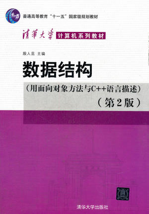

# Data-Structure
教材 《数据结构（用面向对象方法与C++语言描述）》（第二版）  
教材作者 殷人昆  

<!-- TOC -->
**数据结构复习大纲目录**
  
- [第一章 数组](./数组.md)  
- [第二章 链表](./链表.md)  
- [第三章 栈](./栈.md)  
- [第四章 队列](./队列.md)  
- [第五章 数组、串和广义表]
- [第六章 树](./树.md)  
- [第六章 集合与字典]  
- [第七章 搜索结构]  
- [第八章 图](./图.md)  
- [第九章 排序](./排序.md)  
- [第十章 文件、外部排序与搜索]  
- [第十章 查找](./查找.md)  
<!-- /TOC -->
Author：Pitaohc

