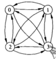
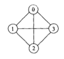
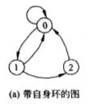
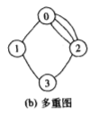
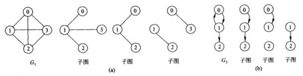
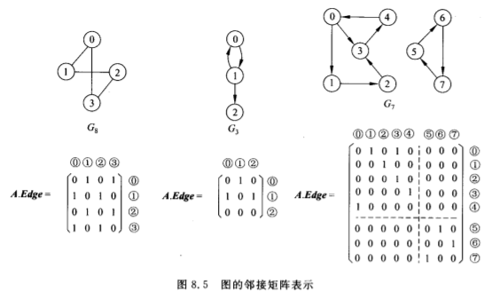
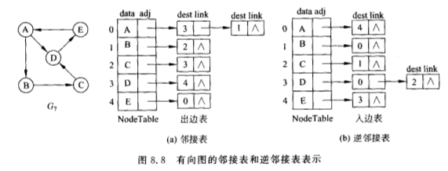
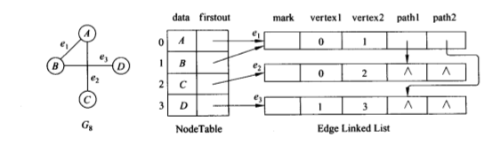

# 第八章 图
<!---toc--->
- [8.1 图的概念]
- [8.2 图的储存结构]
- [8.3 图的遍历]
- [8.4 最小生成树]
- [8.5 AOV网络]
- [8.6 AOE网络]
<!---/toc--->

## 8.1 图的概念
图(graph)，每个顶点可以与多个其他顶点相关联，
顶点之间的关系是任意的  
**Graph** = (V, E)  
**Vertex** = {x| x∈集合}  
**Edge** = {<x, y>| x,y∈V && Path(x,y)}  
**有向图**(directed graph)，边是**有**方向的，用<x, y>表示  
**无向图**(undirected graph)，边是**无**方向的，用(x, y)表示  
**自环**(self loop),（x, x) <x, x>   
**多重图**(multigraph)，两个点之间有多条边链接  
   
    
**完全图**(complete graph)，所有点之间都有边，
有向图共有n\*(n-1)条边，无向图有n\*(n-1)/2条边  
**子图**(subgraph) 子图⊆图  
  

**权值**(weight)，路径的长度  
**邻接顶点**(adjacent vertex)，(u, v) u和v互为邻接顶点，
<u, v> u邻接到v(v邻接自u)  
**度**(degree)，与顶点v关联的边数，deg(v)是入度和出度之和  
**入度**(in degree),v为终点的边数  
**出度**(out degree)，v为起点的边数  

**路径**(path),从vi到vj，经过的顶点或边的集合  
**连通**(connected)，vi到vj**存在路径**，则vi到vj是**连通**的  
**连通图**(connected graph),在**无向图**中**任意**一对顶点都是连通的  
**连通分量**(connected component)，**非连通图**中**最大**的连通**子图**  
**强连通图**(connected graph),在**有向图**中**任意**一对顶点都是连通的  
**连通分量**(connected component)，**非强连通图**中**最大**的连通**子图** 

**生成树**(spanning tree),无向图的极小连通子图，有n-1条边且连通。
有向图，诺干有向树组成的生成森林 

## 8.2 图的储存结构

邻接矩阵(adjacency matrix)
- 使用二位数组储存边
- 边较少时浪费大

邻接表(adjacency list)
- 使用链表储存边

邻接表记录出度，逆邻接表记录入度

邻接多重表(adjacency multilist)

## 8.3 图的遍历

## 8.4 最小生成树

## 8.5 AOV网络

## 8.6 AOE网络

