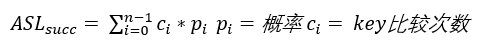
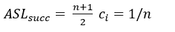
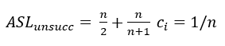
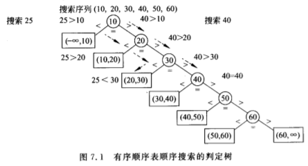

# 第十章 查找
<!---toc--->
- [顺序查找]
- [二分查找]
- [Hash查找]

<!---/toc--->
## 顺序查找
顺序查找(sequential search),从表头开始逐个对比  
平均搜索长度：  
  
  等概率情况  
  不成功情况  

  

## 二分查找
算法：  
1. 求搜索区正中间元素的下标
2. if(a[mid].key == x) 搜索成功
3. if(a[mid].key <  x) x在搜索区右侧
3. if(a[mid].key >  x) x在搜索区左侧  

比较次数 O(logn)  
### 二叉搜索树
//to do
直接输入搜索序列，构造类似二分查找的判定树，就能实现快速搜索
## Hash查找

