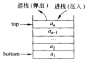
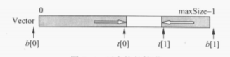
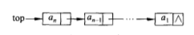
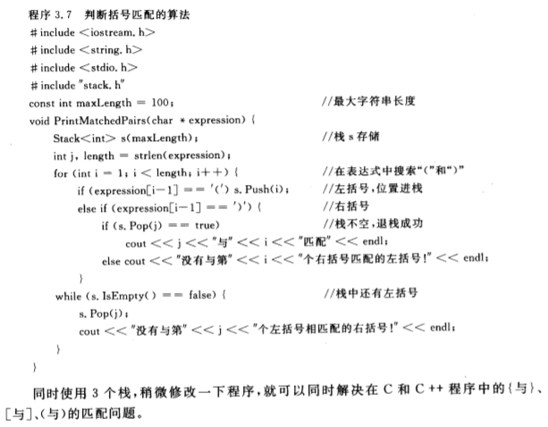
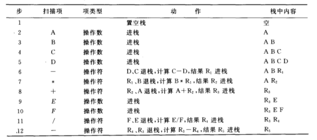
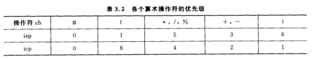
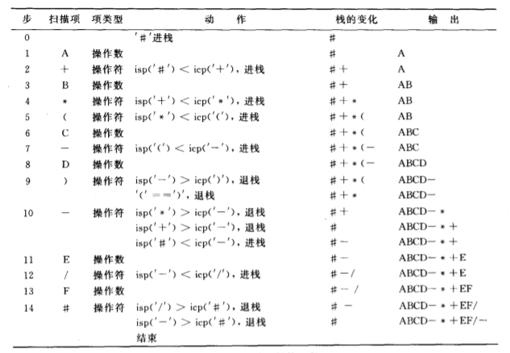
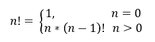
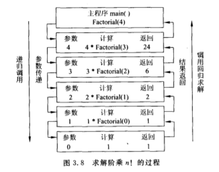
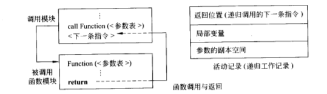

# 第三章 栈
<!---toc--->
- [3.1 定义]
- [3.2 顺序栈]
- [3.3 链式栈]
- [3.4 应用]
- [3.5 递归]
- [3.6 回溯法]
<!---/toc--->
## 3.1 定义
栈(stack)，又名LIFO表(last in first out),
是只允许在表末端进行插入和删除  
栈顶(top)，允许插入和删除的一端  
栈底(bottom),不允许操作  

## 3.2 顺序栈
顺序栈(sequential stack),基于数组的表示
1. 变量成员：
- 数组
- 栈顶指针
- 最大个数
2. 函数成员：
- 构造函数
- 赋值构造
- 复制构造
- 析构函数
- 退栈(pop)
- 入栈(push)
- 栈空
- 栈满
- 返回个数
- 清空
- 重载输出

双栈/多栈设计  
原因 
1. 栈空间大，但容纳的元素不多，容易造成空间浪费
2. 程序中存在多个栈

优势：两个栈共用一个栈空间，减少空间浪费

架构设计：
两个栈共用一段空间，栈底位于两端  
  
n(n>2)个栈，采用多个栈共享栈空间的顺序存储方式，处理复杂，
且插入元素时**移动量大**。解决办法是采用**链表**作为栈的存储结构。
## 3.3 链式栈
链式栈(linked stack),基于链表的表示  
  
优势：  
1. 便于插入和删除，操作规则与链表的特点吻合
2. 多栈时便于共享储存空间

栈顶和栈底：在表头或表尾，根据插入的方式不同

## 3.4 应用
### 括号匹配

利用栈来确认表达式的正确性  
e.g. (a\*(b+c)-d)

---
### 表达式计算

表达式：由操作数，操作符和分界符组成，通常有3种表示：
1. 前缀(prefix)表达式：+ 1 2
2. 中缀(infix)表达式：1 + 2
3. 后缀(postfix)表达式：1 2 +

我们平时使用的都是中缀表达式  
为了正确执行，必须说明操作符的优先级  
表达式类型：  
- 算数操作符 + - \* / %
- 关系操作符 < <= == >= > !=
- 逻辑操作符 && || !
- 括号操作符 ( )

计算顺序：
- 优先级高先计算
- 左边的先计算
- 存在括号时，括号内先计算

中缀表达式中存在运算顺序和括号问题，程序不易处理  
解决办法是使用**前缀表达式**或**后缀表达式**  
后缀表达式(常用)需要一个栈，前缀表达式 需要两个栈  
编译程序使用后缀求表达式的值

***后缀表达式***，又称RPN或逆波兰记号  
**操作**:从左到右扫描，并用一个栈暂存操作数和计算结果

### 中缀和后缀的转换
ISP(in stack priority)栈内优先数，
ICP(in coming priority)栈外优先数  
  
处理顺序：
1. 操作符栈初始化
2. 读入第一个字符
3. while(ch!=停止符)
   1. if(ch为操作数)       直接入栈，读取下一字符
   2. if(icp(ch)>isp(op)) 进栈，读取下一字符
   3. if(icp(ch)<isp(op)) 退栈，输出
   4. if(icp(ch)==isp(op))退栈
      1. if(ch=='(') 读取下一字符
4. 结束，输出序列为后缀表达式 

  

## 3.5 递归

递归：若一个对象部分包含自己，
或用自己定义自己则称这个对象是递归的。
而且若一个过程调用自己，则称这个过程是递归的。
### 定义递归
e.g. 阶乘，幂函数，斐波那契数列

- 复杂问题分解为子问题
- 分解后的子问题可以直接解决，就停止分解
- 递归定义的函数可以用递归过程来编程求解
- 递归过程直接反映递归结构

### 数据递归
e.g.链表，树，图  
链表递归定义：
- if(first == NULL) 是空表
- if(first != NULL) link指向一个链表

对于递归的结构，使用递归方式编写算法特别方便

### 算法递归
e.g. 汉诺塔问题(Tower of Hanoi)

递归与递推是两个概念
递推：利用问题本身所具有的关系对问题求解，
能从已知信息中推出答案，
递推问题可以递归求解，可以迭代(重复)的方法求解
### 递归工作栈
为了保证递归的正确执行，需要解决调用时参数传递和返回地址问题  
采用**保存现场**的做法  
**递归工作栈**：
1. 返回地址：下一条语句的地址
2. 实参副本
3. 局部变量
用**栈**实现递归过程
**栈顶的工作记录**一定是当前正在执行的这一层的记录，
所以又称为**活动记录**
  
  
对尾递归或单向递归都可以利用迭代的方法，
将递归过程改为非递归过程

## 3.6 回溯法
回溯法(backtracking)，又称试探法，
将问题的候选解按照顺序逐一判定  
用回溯法求解问题时常常使用栈或递归方式，帮助向前试探和回溯
