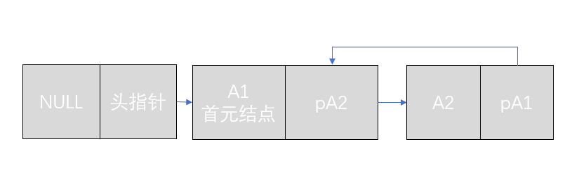
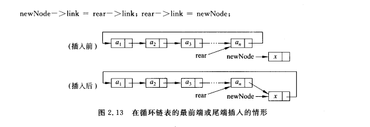
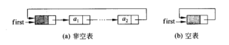
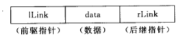
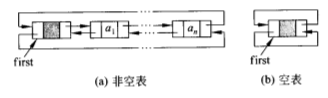

# ��捐〃
<!---toc--->
- [2.1 �����捐〃]
- [2.2 寰������捐〃]
- [2.3 ��������捐〃]
- [2.4 ��������捐〃]
<!---/toc--->

<<<<<<< HEAD
## 2.1 单链表
> 链表与数组的比较：

数组：  
- 优点
   1. 无需为表示结点间的逻辑关系而增加额外的存储空间，
存储利用率高
   2. 可以随机存储，存取速度快
- 缺点
   1. 插入删除时，为了维护关系，移动元素多，效率低
   2. 占用连续空间，难以应对大表和经常变化长度的表

链表
- 优点
   1. 改变大小效率高
   2. 占用零碎空间，利用率高
- 缺点
   1. 不能随机存储
   2. 需要指针域

单链表概念：  
单链表(singly linked list)，又名线性链表，用它来表示线性表时，
用指针表示节点间的逻辑关系  
=======
## 2.1 �����捐�?
> ��捐〃涓���扮�����姣�杈�锛?

��扮��锛? 
- 浼����
   1. ������涓鸿〃绀虹����归�寸����昏����崇郴���澧����棰�澶����瀛���ㄧ┖��达��瀛���ㄥ�╃�?
���楂�
   2. ���浠ラ����哄�����锛�瀛�������搴�蹇?
- 缂虹��
   1. �����ュ����ゆ�讹��涓轰��缁存�ゅ�崇郴锛�绉诲�ㄥ��绱�澶�锛�������浣�
   2. �����ㄨ��缁�绌洪�达����句互搴�瀵瑰ぇ琛ㄥ��缁�甯稿�������垮害���琛�

��捐〃
- 浼����
   1. ��瑰��澶у��������楂?
   2. �����ㄩ�剁��绌洪�达����╃�ㄧ��楂?
- 缂虹��
   1. 涓���介����哄�����
   2. ���瑕����������

�����捐〃姒�蹇碉��  
�����捐�?singly linked list)锛�������绾挎�ч�捐〃锛���ㄥ����ヨ〃绀虹嚎��ц〃��?
锛���ㄦ�����琛ㄧず�����归�寸����昏����崇郴  
>>>>>>> 5b5d3da4cf0ceaa8710b4604e2e9e3d515796923

|data|link|
|---|---|

<<<<<<< HEAD
data：数据域，存放线性表一个数据元素  
link：指针域，存放指向下一结点的指针  
首元节点：链表的第一个结点  
特点：  
1. 方便扩充长度  
2. 逻辑顺序与实际物理顺序不一致

类定义  
1. 结点类成员  
    1. 数据成员
       - 数据存储
       - 指针存储
2. 链表类成员
    1. 数据成员
       - 头指针
       - 当前长度
    2. 函数成员
       - 构造函数
       - 复制构造
       - 重载赋值函数
       - 重载输入
       - 重载输出
       - 析构函数 
       - 插入结点
       - 删除结点
       - 返回头结点地址
       - 返回长度
       - 判断链表空
       - 搜索元素
       - 取出元素
       - 修改元素
       - 清空链表  

插入的两个方法：  
1. 前插法
插入到first指针之后，成为首元结点
2. 后插法
插入链表尾，成为最后的结点，需要一个last尾指针(或称tail)  

## 2.2 循环链表

尾结点link域指向首元结点  
  
插入算法：  
新元素插入链表尾，链尾结点指向新结点，新结点指向首元结点  
  
空表：  
存在一个未初始化的元素，link域指向自己

数据成员：  继承singly linked list
- 存储链尾结点
## 2.3 双向链表
双向链表(doubly linked list)，又称双链表，有两个指针域，
指向前驱和后继  
  
双向链表常采用带附加头结点的循环链表方式，首元结点不存放数据，
或存放EOF  

=======

data锛���版�����锛�瀛���剧嚎��ц〃涓�涓���版�����绱? 
link锛����������锛�瀛���炬�����涓�涓�缁���圭�������? 
棣���������癸����捐〃���绗�涓�涓�缁���? 
## 2.2 寰������捐〃
>>>>>>> 5b5d3da4cf0ceaa8710b4604e2e9e3d515796923

## 2.3 ��������捐〃

## 2.4 ��������捐�?

END
