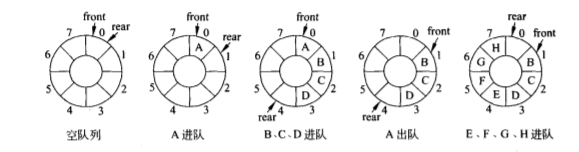
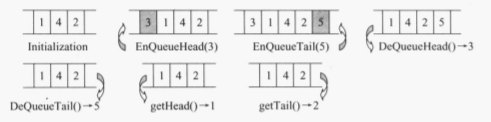

# 第四章 队列
<!---toc--->
- [4.1 队列的概念]
- [4.2 循环队列]
- [4.3 链式队列]
- [4.4 优先队列]
- [4.5 双端队列]
<!---/toc--->

## 4.1 队列的概念

**队列**(queue)，又称**FIFO表**(first in first out),
只允许在表的一端插入，在另一端删除
**队尾**(rear)，插入端
**队首**(front)，删除端

储存表示方式：
1. 基于数组
2. 基于链表
## 4.2 循环队列
循环队列(circular queue)，避免假溢出  
队满： `front == rear == maxSize`  
假溢出：队满，但是front之前还有空间  

队头指针进1 `front = (front+1)%maxSize;`  
队尾指针进1 `rear = (rear+1)%maxSize;`

循环队列队空： `rear == front`  
循环队列队满： `(rear+1)%maxSize == front`  
为了区别队空条件，最多存放maxSize-1个元素  
如果希望能存放maxSize个元素，可以存放一个附加标记tag，
记录最后一次加入删除操作
  

数据成员：
- 存放数组
- 队头指针
- 队尾指针
- 最大容量
函数成员：
- 构造函数
- 析构函数
- push
- pop
- 返回大小
- 清空队列
- 判定队空
- 判定队满
- 重载输出

## 4.3 链式队列
链式队列(linked queue)  
队头指针指向首元结点  
队尾指针指向表尾结点  

优势：
- 数据数量变动大
- 不存在溢出

数据成员
- 队头指针
- 队尾指针
函数成员
- 构造函数
- 析构函数
- push
- pop
- 清空队列
- 判定队空
- 返回大小

## 4.4 优先队列
优先队列(Priority Queue)，
每次从队列中取出的是优先级最高的元素
取出优先级最高且最早入队的元素  

| 任务编号 | 1 | 2 |3 | 4 | 5 | 
| :---| :---: | :---: |:---: | :---: |:---: |
| 优先权   | 20 | 0 |  40 | 30 | 10 | 
| 执行顺序 | 3 | 1 |  5 | 4 | 2 |

**数字越小，优先权越高**

数据成员：  
- 存放数组
- 当前个数
- 最大容量
函数成员：  
- 构造函数
- 析构函数
- push
- pop
- top(读取队头元素)
- 判定表空
- 判定表满
- 清空队列
- 返回当前个数
- 队列调整

调整函数时间复杂度O(n)  
## 4.5 双端队列
双端队列(Double-ended queue),允许在两端插入和删除  
  